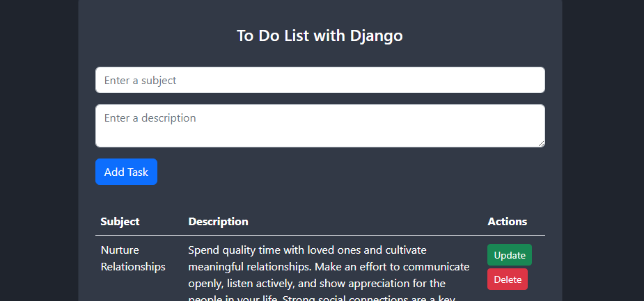

# ToDoList App

---

This is a basic web application designed to manage to-do lists using Django, a Python web development framework.



## Features

- **CRUD Operations:** Users can create, read, update, and delete tasks from the list.
- **Attractive User Interface:** User-friendly interface for easy navigation and task management.

## Technologies Used

- **Django:** Python web development framework.
- **HTML/CSS:** Front-end technologies for design and presentation.
- **SQLite:** Default database included in Django for storing data.

## Usage

Add, view, update, or delete your tasks as needed.

## Project Structure

```
todolist/
├── app/
│   ├── migrations/: Directory containing database migrations for the application model.
│   ├── static/: Directory for storing static files such as CSS, JavaScript, and images.
│   │   └── css/: Directory containing CSS files.
│   │       └── styles.css: CSS file for specific application styles.
│   ├── templates/: Directory containing HTML templates for the application.
│   │   └── app/: Directory containing specific application templates.
│   │       └── index.html: HTML file for the main page of the application.
│   ├── __pycache__/: Directory containing automatically generated Python cache files to optimize module execution.
│   ├── admin.py: Configuration file for Django's admin panel for the application.
│   ├── apps.py: Configuration file for the Django application.
│   ├── models.py: File containing the data models of the application defined using Django ORM.
│   ├── tests.py: File containing unit tests for the application.
│   ├── urls.py: Configuration file for the application's URLs.
│   ├── views.py: File containing the view functions of the application.
│   └── __init__.py: File indicating to Python that the directory is a Python package.
├── todolist/
│   ├── __pycache__/: Directory containing automatically generated Python cache files to optimize module execution.
│   ├── asgi.py: Configuration file for ASGI (Asynchronous Server Gateway Interface).
│   ├── settings.py: Main configuration file for Django containing the project's settings.
│   ├── urls.py: Configuration file for the project's URLs.
│   ├── wsgi.py: Configuration file for WSGI (Web Server Gateway Interface) used for web server deployments.
│   └── __init__.py: File indicating to Python that the directory is a Python package.
├── manage.py: Command-line file providing tools to interact with the Django project, such as running the development server, applying migrations, creating users, etc.
└── db.sqlite3: SQLite3 database used by default in Django to store application data during development.

```


## Installation and Running

Clone the repository:
```
git clone https://github.com/strix07/todo-app/tree/main
```
Navigate to the project directory:
```
cd todolist
```
Install dependencies:
```
pip install -r requirements.txt
```
Run database migrations:
```
python manage.py migrate
```
Start the development server:
```
python manage.py runserver
```
Access the application from your web browser at http://localhost:8000/.

## Whatch more

For more information about my projects and experience, visit my [personal website](https://adrian-mayora-curriculum.netlify.app/en/).

